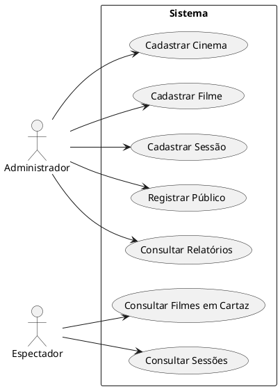
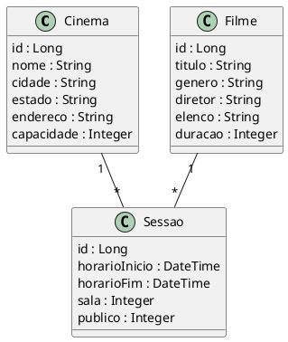
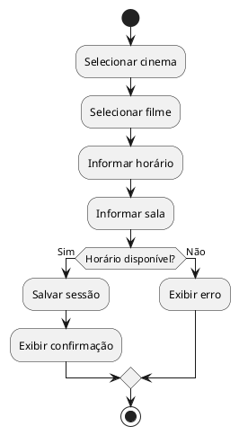
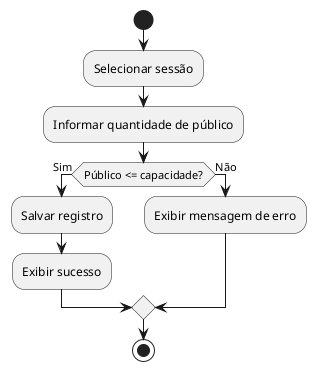
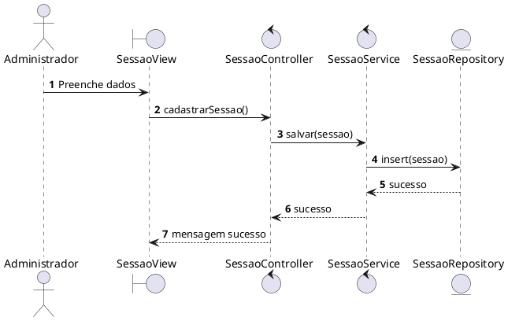
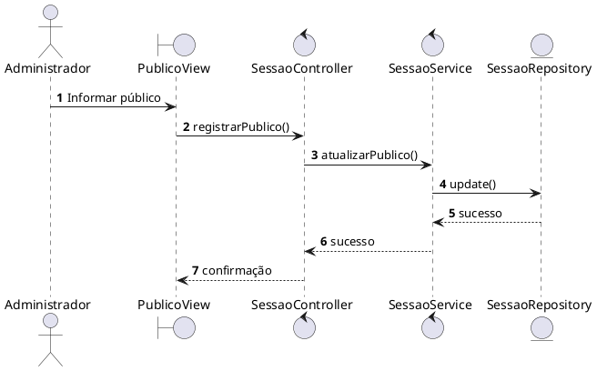

# Sistema de Gestão de Rede de Cinemas

## Integrantes

* Murilo Avarino

---

# 1. Levantamento de Requisitos

## 1.1 Requisitos Funcionais

### RF01 – Cadastro de Cinemas

O sistema deve permitir o cadastro de cinemas contendo:

* Nome;
* Cidade;
* Estado;
* Endereço;
* Capacidade máxima.

### RF02 – Cadastro de Filmes

O sistema deve permitir o cadastro de filmes contendo:

* Título;
* Duração;
* Gênero;
* Diretor;
* Elenco.

### RF03 – Cadastro de Sessões

O sistema deve permitir o cadastro de sessões vinculadas a:

* Um cinema;
* Um filme;
* Horário de início;
* Horário de término;
* Sala.

### RF04 – Registro de Público

O sistema deve permitir registrar a quantidade de espectadores presentes em cada sessão.

### RF05 – Consulta de Filmes em Cartaz

O sistema deve permitir consultar os filmes exibidos em cada cinema.

### RF06 – Relatório de Público

O sistema deve permitir visualizar:

* Público por sessão;
* Público por filme;
* Público por cinema.

---

# 2. Regras de Negócio

### RN01

Uma sessão deve estar vinculada obrigatoriamente a um filme.

### RN02

Uma sessão deve estar vinculada obrigatoriamente a um cinema.

### RN03

O número de espectadores não pode ultrapassar a capacidade máxima do cinema.

### RN04

O horário final da sessão deve considerar a duração do filme.

### RN05

Deve existir intervalo mínimo de 15 minutos entre sessões da mesma sala.

### RN06

Um filme pode ser exibido em vários cinemas.

### RN07

Um cinema pode possuir várias sessões por dia.

---

# 3. Diagrama de Casos de Uso

## Atores

* Administrador
* Espectador

## Casos de Uso

### Administrador

* Cadastrar Cinema
* Cadastrar Filme
* Cadastrar Sessão
* Registrar Público
* Consultar Relatórios

### Espectador

* Consultar Filmes em Cartaz
* Consultar Sessões

---

# 4. Código PlantUML – Caso de Uso



---

# 5. Diagrama de Classes do Domínio

## Entidades

### Cinema

* id
* nome
* cidade
* estado
* endereco
* capacidade

### Filme

* id
* titulo
* genero
* diretor
* elenco
* duracao

### Sessao

* id
* horarioInicio
* horarioFim
* sala
* publico

---

# 6. Código PlantUML – Diagrama de Classes



---

# 7. Diagramas de Atividade

## 7.1 Cadastro de Sessão



---

## 7.2 Registro de Público



---

# 8. Diagramas de Sequência

## 8.1 Cadastro de Sessão



---

## 8.2 Registro de Público



---

# 9. Implementação do Sistema

## 9.1 Tecnologias Utilizadas

* Java 17
* Spring Boot
* SQLite
* Maven
* JPA/Hibernate

---

# 10. Estrutura do Projeto

```text
cinema-system/
│
├── src/main/java/com/cinema/
│   ├── controller/
│   ├── service/
│   ├── repository/
│   ├── model/
│   └── CinemaSystemApplication.java
│
├── src/main/resources/
│   └── application.properties
│
└── pom.xml
```

---

# 11. Modelo MVC + Service + Repository

## 11.1 Entity – Cinema

```java
package com.cinema.model;

import jakarta.persistence.*;

@Entity
public class Cinema {

    @Id
    @GeneratedValue(strategy = GenerationType.IDENTITY)
    private Long id;

    private String nome;
    private String cidade;
    private String estado;
    private String endereco;
    private Integer capacidade;

    public Long getId() {
        return id;
    }

    public void setId(Long id) {
        this.id = id;
    }

    public String getNome() {
        return nome;
    }

    public void setNome(String nome) {
        this.nome = nome;
    }

    public String getCidade() {
        return cidade;
    }

    public void setCidade(String cidade) {
        this.cidade = cidade;
    }

    public String getEstado() {
        return estado;
    }

    public void setEstado(String estado) {
        this.estado = estado;
    }

    public String getEndereco() {
        return endereco;
    }

    public void setEndereco(String endereco) {
        this.endereco = endereco;
    }

    public Integer getCapacidade() {
        return capacidade;
    }

    public void setCapacidade(Integer capacidade) {
        this.capacidade = capacidade;
    }
}
```

---

## 11.2 Entity – Filme

```java
package com.cinema.model;

import jakarta.persistence.*;

@Entity
public class Filme {

    @Id
    @GeneratedValue(strategy = GenerationType.IDENTITY)
    private Long id;

    private String titulo;
    private String genero;
    private String diretor;
    private String elenco;
    private Integer duracao;

    public Long getId() {
        return id;
    }

    public void setId(Long id) {
        this.id = id;
    }

    public String getTitulo() {
        return titulo;
    }

    public void setTitulo(String titulo) {
        this.titulo = titulo;
    }

    public String getGenero() {
        return genero;
    }

    public void setGenero(String genero) {
        this.genero = genero;
    }

    public String getDiretor() {
        return diretor;
    }

    public void setDiretor(String diretor) {
        this.diretor = diretor;
    }

    public String getElenco() {
        return elenco;
    }

    public void setElenco(String elenco) {
        this.elenco = elenco;
    }

    public Integer getDuracao() {
        return duracao;
    }

    public void setDuracao(Integer duracao) {
        this.duracao = duracao;
    }
}
```

---

## 11.3 Entity – Sessao

```java
package com.cinema.model;

import jakarta.persistence.*;
import java.time.LocalDateTime;

@Entity
public class Sessao {

    @Id
    @GeneratedValue(strategy = GenerationType.IDENTITY)
    private Long id;

    private LocalDateTime horarioInicio;
    private LocalDateTime horarioFim;
    private Integer sala;
    private Integer publico;

    @ManyToOne
    private Cinema cinema;

    @ManyToOne
    private Filme filme;

    public Long getId() {
        return id;
    }

    public void setId(Long id) {
        this.id = id;
    }

    public LocalDateTime getHorarioInicio() {
        return horarioInicio;
    }

    public void setHorarioInicio(LocalDateTime horarioInicio) {
        this.horarioInicio = horarioInicio;
    }

    public LocalDateTime getHorarioFim() {
        return horarioFim;
    }

    public void setHorarioFim(LocalDateTime horarioFim) {
        this.horarioFim = horarioFim;
    }

    public Integer getSala() {
        return sala;
    }

    public void setSala(Integer sala) {
        this.sala = sala;
    }

    public Integer getPublico() {
        return publico;
    }

    public void setPublico(Integer publico) {
        this.publico = publico;
    }

    public Cinema getCinema() {
        return cinema;
    }

    public void setCinema(Cinema cinema) {
        this.cinema = cinema;
    }

    public Filme getFilme() {
        return filme;
    }

    public void setFilme(Filme filme) {
        this.filme = filme;
    }
}
```

---

# 12. Repository

## SessaoRepository

```java
package com.cinema.repository;

import com.cinema.model.Sessao;
import org.springframework.data.jpa.repository.JpaRepository;

public interface SessaoRepository extends JpaRepository<Sessao, Long> {
}
```

---

# 13. Service

## SessaoService

```java
package com.cinema.service;

import com.cinema.model.Sessao;
import com.cinema.repository.SessaoRepository;
import org.springframework.beans.factory.annotation.Autowired;
import org.springframework.stereotype.Service;

@Service
public class SessaoService {

    @Autowired
    private SessaoRepository repository;

    public Sessao salvar(Sessao sessao) {
        return repository.save(sessao);
    }
}
```

---

# 14. Controller

## SessaoController

```java
package com.cinema.controller;

import com.cinema.model.Sessao;
import com.cinema.service.SessaoService;
import org.springframework.beans.factory.annotation.Autowired;
import org.springframework.web.bind.annotation.*;

@RestController
@RequestMapping("/sessoes")
public class SessaoController {

    @Autowired
    private SessaoService service;

    @PostMapping
    public Sessao cadastrar(@RequestBody Sessao sessao) {
        return service.salvar(sessao);
    }
}
```

---

# 15. Configuração SQLite

## application.properties

```properties
spring.datasource.url=jdbc:sqlite:cinema.db
spring.datasource.driver-class-name=org.sqlite.JDBC

spring.jpa.database-platform=org.hibernate.community.dialect.SQLiteDialect
spring.jpa.hibernate.ddl-auto=update
spring.jpa.show-sql=true
```

---

# 16. Dependências Maven

## pom.xml

```xml
<dependencies>

    <dependency>
        <groupId>org.springframework.boot</groupId>
        <artifactId>spring-boot-starter-web</artifactId>
    </dependency>

    <dependency>
        <groupId>org.springframework.boot</groupId>
        <artifactId>spring-boot-starter-data-jpa</artifactId>
    </dependency>

    <dependency>
        <groupId>org.xerial</groupId>
        <artifactId>sqlite-jdbc</artifactId>
        <version>3.45.1.0</version>
    </dependency>

    <dependency>
        <groupId>org.hibernate.orm</groupId>
        <artifactId>hibernate-community-dialects</artifactId>
    </dependency>

</dependencies>
```

---

# 17. Caso de Uso Implementado

## Cadastro de Sessão

Fluxo:

1. Administrador envia os dados da sessão;
2. Controller recebe os dados;
3. Service aplica regras de negócio;
4. Repository salva no banco SQLite;
5. Sistema retorna confirmação.

---

# 18. Conclusão

O sistema desenvolvido atende às principais necessidades da rede de cinemas, permitindo:

* Controle de filmes em cartaz;
* Organização das sessões;
* Registro de público;
* Consulta de relatórios;
* Estruturação em arquitetura MVC com camadas Service e Repository.

Além disso, a solução utiliza SQLite para persistência de dados e aplica conceitos de UML integrados à implementação do software.
